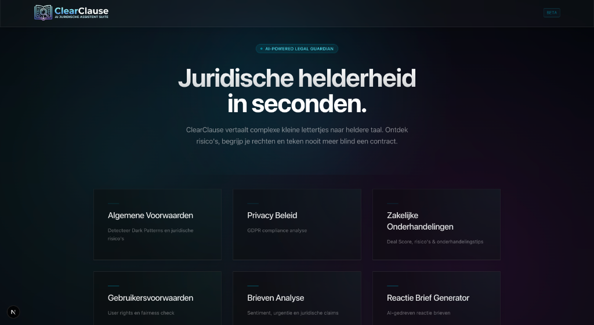

# ClearClause

<div align="center">
  
  <p><strong>AI-assisted legal document analysis</strong></p>
  <p>Maak complexe juridische documenten begrijpelijker en ontdek risico's voordat u tekent.</p>
</div>

<p align="center">
  
  
  
  
  
  
  
</p>



ClearClause analyseert juridische tekst, PDF's en afbeeldingen met mode-specifieke prompts en gestructureerde JSON-output. De tool is bedoeld voor uitleg, risico-identificatie en voorbereiding. ClearClause vervangt geen advocaat of juridisch advies.

## Functies

- Analyse van geplakte juridische tekst
- Upload en tekstextractie van PDF's
- OCR van afbeeldingen en screenshots via GPT-4o Vision
- Mode-specifieke analyse voor verschillende juridische situaties
- Rode vlaggen met bronpassage, risico-type, uitleg en ernstscore
- Per risico een concrete actie: **Wat nu?**
- Samenvatting, aanbevelingen en score in een dashboard
- Mode-specifieke details voor privacybeleid, gebruikersvoorwaarden en brieven
- Maximaal drie contextuele vervolgvragen per analyse
- PDF-export met samenvatting, scores, bronquotes, risico's en acties
- Request-ID tracing via `X-Request-ID` en JSON-logs
- Request-validatie, uploadlimieten, JWT-structuur en rate limiting
- Docker healthchecks en Nginx security headers

## Analysemodi

| Modus | Doel |
| --- | --- |
| Algemene voorwaarden | Dark patterns en juridische risico's detecteren |
| Privacybeleid | GDPR-compliance, datacategorieen en ontbrekende elementen analyseren |
| Gebruikersvoorwaarden | Gebruikersrechten, beperkingen en fairness beoordelen |
| Brievenanalyse | Urgentie, claims, deadlines en reactie-strategie analyseren |
| Reactiebrief-generator | Een professionele conceptreactie opstellen |
| Zakelijke onderhandelingen | Dealrisico's, balans en onderhandelingstips beoordelen |
| Webdeals en aanbiedingen | Verborgen kosten en oneerlijke online voorwaarden signaleren |

## Architectuur

```text
clear-clause/
├── main.py                         # FastAPI-app en API-routes
├── modules/
│   ├── analysis/
│   │   ├── models.py               # Pydantic response-modellen
│   │   ├── service.py              # GPT-4o-analyse en chunk merging
│   │   ├── file_processor.py       # PDF-extractie en Vision OCR
│   │   ├── modes.py                # Beschikbare analysemodi
│   │   ├── prompts/                # Mode-specifieke prompts
│   │   └── utils.py                # Token counting en chunking
│   ├── auth/                       # JWT-validatie en rate limiting
│   ├── chat/                       # Contextuele vervolgchat
│   ├── api/                        # Routes, requestmodellen en response-normalisatie
│   └── shared/                     # OpenAI-client en structured logging
├── frontend/
│   ├── app/                        # Next.js App Router-pagina's
│   ├── components/                 # Analyseformulier en dashboards
│   └── lib/api.ts                  # Typed API-client
├── nginx/                          # Reverse proxy-configuratie
├── Dockerfile
└── docker-compose.yml
```

### Backend

- FastAPI
- OpenAI GPT-4o en GPT-4o Vision
- Pydantic structured output
- PyMuPDF voor PDF-tekstextractie
- `tiktoken` voor token counting en documentchunking
- JWT-validatie met `python-jose`
- AsyncOpenAI-client met parallelle chunk-analyse
- Structured JSON logging met request-ID context
- Ruff en mypy configuratie via `pyproject.toml`

### Frontend

- Next.js 16 met App Router
- React 19 en TypeScript
- Tailwind CSS 4
- Radix UI en Lucide React
- `@react-pdf/renderer` voor PDF-export

## Snel starten

### Vereisten

- Python 3.11 of nieuwer
- Node.js 20 of nieuwer
- npm
- Een OpenAI API-key voor echte analyses
- Docker Desktop (optioneel, voor de volledige stack)

### Backend lokaal starten

```bash
python3 -m venv .venv
source .venv/bin/activate
pip install -r requirements.txt
pip install -r requirements-dev.txt  # optioneel: tests en static analysis
cp .env.example .env
```

Vul daarna `OPENAI_API_KEY` in `.env` in. Start de API met:

```bash
python3 main.py
```

De backend draait standaard op `http://127.0.0.1:8000`.

De interactieve API-documentatie is beschikbaar op `http://127.0.0.1:8000/docs`.

### Frontend lokaal starten

```bash
cd frontend
npm install
npm run dev
```

De frontend draait standaard op `http://localhost:3000`.

Voor een andere backend-url kan `NEXT_PUBLIC_API_URL` worden ingesteld:

```bash
NEXT_PUBLIC_API_URL=http://127.0.0.1:8000 npm run dev
```

## Docker

Configureer `.env` met minimaal:

```env
OPENAI_API_KEY=sk-jouw-api-key
SECRET_KEY=gebruik-een-lange-willekeurige-productiesleutel
ALGORITHM=HS256
ENVIRONMENT=production
ALLOWED_ORIGINS=https://jouw-frontend-domein.example
```

Start vervolgens de volledige stack:

```bash
docker compose up --build
```

De Nginx gateway is beschikbaar op `http://localhost`.

De backend en frontend hebben Docker healthchecks. De gateway start pas wanneer beide services healthy zijn.

## Configuratie

| Variabele | Verplicht | Beschrijving |
| --- | --- | --- |
| `OPENAI_API_KEY` | Ja | API-key voor analyse, chat en Vision OCR |
| `SECRET_KEY` | Productie | JWT signing key; gebruik een lange willekeurige waarde |
| `ALGORITHM` | Nee | JWT-algoritme, standaard `HS256` |
| `ENVIRONMENT` | Nee | `development` accepteert de lokale auth-flow; productie vereist `SECRET_KEY` |
| `ALLOWED_ORIGINS` | Nee | Komma-gescheiden CORS-origins |
| `LOG_LEVEL` | Nee | Loglevel voor JSON-logs, standaard `INFO` |
| `NEXT_PUBLIC_API_URL` | Nee | Backend-url die de browser gebruikt |
| `NEXT_PUBLIC_API_TOKEN` | Nee | Optionele Bearer-token voor niet-development backends |

Kopieer `.env.example` naar `.env` en vul nooit echte waarden in een gecommit bestand in.

## API

| Methode | Endpoint | Beschrijving |
| --- | --- | --- |
| `GET` | `/health` | Health check |
| `GET` | `/modes` | Beschikbare analysemodi en metadata |
| `POST` | `/analyze` | Geplakte tekst analyseren |
| `POST` | `/analyze-file` | PDF of afbeelding analyseren |
| `POST` | `/chat` | Vervolgvraag over documentcontext beantwoorden |

Voorbeeld van `POST /analyze`:

```json
{
  "text": "De volledige tekst van het document...",
  "document_name": "Algemene voorwaarden - Bedrijf X",
  "mode": "algemene_voorwaarden",
  "context": null
}
```

De response bevat een uniforme dashboardvorm met onder andere `mode`, `summary`, `red_flags`, `suggestions`, `privacy_score` en `privacy_motivatie`. Mode-specifieke velden blijven daarnaast beschikbaar in dezelfde response.

Een risico bevat altijd een bronpassage en een actie:

```json
{
  "clause_citation": "De overeenkomst wordt automatisch verlengd...",
  "risk_type": "forced_continuity",
  "explanation": "De gebruiker kan ongemerkt opnieuw worden gefactureerd.",
  "severity_score": 8,
  "action_required": "Controleer de opzegtermijn en vraag om een expliciete herinnering."
}
```

Alle responses bevatten een `mode`-veld. De backend retourneert bovendien een `X-Request-ID`-header. Gebruik die waarde om een gebruikersmelding aan de bijbehorende JSON-logregels te koppelen.

## Security en privacy

- Zet nooit echte secrets in Git.
- Gebruik in productie altijd een sterke `SECRET_KEY`.
- Development accepteert uitsluitend de development mock-auth-flow.
- Requests zijn begrensd op 1 MB.
- Tekstvelden en chatgeschiedenis hebben expliciete limieten.
- De backend gebruikt server-side rate limiting per IP; de huidige implementatie is in-memory en bedoeld voor de MVP.
- Rate limiting is momenteel single-instance. Gebruik Redis voordat meerdere backendreplica's worden uitgerold.
- Analyseconclusies worden gevraagd te verwijzen naar exacte bronpassages. Controleer belangrijke juridische beslissingen altijd zelf.
- Nginx voegt onder andere CSP, frame-, content-type-, referrer- en permissions-headers toe.
- Gevoelige juridische documenten kunnen naar de geconfigureerde AI-provider worden verzonden. Voeg geen documenten toe zonder het privacy- en verwerkingsbeleid te controleren.
- ClearClause geeft geen formeel juridisch advies en vervangt geen advocaat.

## Development checks

Backend syntax controleren:

```bash
python3 -m compileall -q main.py modules
```

Backend test dependencies installeren en tests draaien:

```bash
pip install -r requirements-dev.txt
pytest
```

Static analysis uitvoeren:

```bash
ruff check .
mypy main.py modules
```

Frontend controleren:

```bash
cd frontend
npm test
npm run lint
npx tsc --noEmit
npm run build
```

## Status en roadmap

ClearClause is een V1 MVP: de kernflow, analyse-output, actiegerichte presentatie, PDF-export en testpiramide zijn aanwezig. De eerstvolgende product- en infrastructuurprioriteiten zijn:

1. Redis-rate limiting en schaalbare quota.
2. Paginanummers en fijnmazigere bronverwijzingen voor PDF-bevindingen.
3. Request metrics en kostenmonitoring voor AI-providergebruik.
4. Analysehistorie en accounts na validatie van de kernflow.
5. Teamfuncties, integraties en betaalde quota.

## Bijdragen

Voor wijzigingen:

1. Maak een feature branch vanaf `main`.
2. Voeg backendtests of frontendtests toe voor nieuw gedrag.
3. Draai de volledige checks uit:

```bash
.venv/bin/pytest -q
.venv/bin/ruff check .
.venv/bin/mypy main.py modules
cd frontend
npm test
npm run lint
npx tsc --noEmit
npm run build
```

4. Beschrijf in de pull request de gebruikersimpact, risico's en testresultaten.

## Licentie

Dit project is een MVP voor educatieve en experimentele doeleinden. Er is momenteel geen aparte open-source licentie gepubliceerd.
