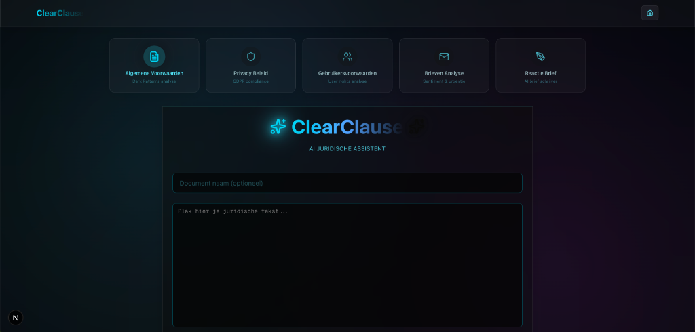

# ClearClause MVP

Een AI-gedreven juridische analyse tool die algemene voorwaarden en privacyverklaringen analyseert met behulp van drie gespecialiseerde persona's: De Jurist, De Ethicus en De Vertaler.

## 🏗️ Architectuur

### Backend (FastAPI + GPT-4o)

- **Model**: `gpt-4o` voor sterke juridische redeneerkracht
- **Dark Patterns Lexicon**: 11 gedefinieerde risico-patronen
- **Structured Output**: JSON Schema validatie via Pydantic
- **Token Management**: Automatische context window checks

### Frontend (Next.js 14)

- **Framework**: Next.js met App Router
- **Styling**: Tailwind CSS + Shadcn/UI
- **Componenten**: Card, Table, Badge, Progress, Textarea
- **Iconen**: Lucide React

## 🚀 Installatie

### Backend Setup

```bash
# Navigeer naar de root
cd clear-clause

# Activeer de virtual environment
source .venv/bin/activate

# Installeer dependencies
pip install -r requirements.txt

# Configureer je OpenAI API key
# Bewerk .env en vervang de placeholder
OPENAI_API_KEY=sk-jouw-echte-key-hier

# Start de API
python main.py
```

De API draait nu op `http://localhost:8000`

### Frontend Setup

```bash
# Navigeer naar de frontend
cd frontend

# Installeer dependencies
npm install

# Start de development server
npm run dev
```

De frontend draait nu op `http://localhost:3000`

## 📋 Features

### Backend

- ✅ **Lexicon-gebaseerde detectie**: 11 Dark Patterns (forced_continuity, confirmshaming, etc.)
- ✅ **Drie-Persona Analyse**: Jurist, Ethicus, Vertaler
- ✅ **Structured JSON Output**: Gevalideerd via Pydantic
- ✅ **CORS Support**: Geconfigureerd voor Next.js frontend
- ✅ **Health Endpoint**: `/health` voor monitoring
- ✅ **Token Counting**: Preventieve checks voor context window

### Frontend

- ✅ **Intuïtief Formulier**: Tekst input + document naam
- ✅ **Loading Visualisatie**: Drie experts animatie
- ✅ **4-Kolommen Dashboard**:
  - Samenvatting (max 5 punten)
  - Rode Vlaggen Tabel (met severity badges)
  - Suggesties (genummerde actielijst)
  - Privacy Score (circulaire gauge)
- ✅ **Error Handling**: Gebruiksvriendelijke foutmeldingen
- ✅ **Responsive Design**: Mobile-first approach

## 🔒 Beveiliging (Kairos Protocol)

Dit project volgt de **Kairos Grondwet**:

- ✅ Geen hardcoded secrets (`.env` voor API keys)
- ✅ Input validatie via Pydantic
- ✅ CORS configuratie voor specifieke origins
- ✅ `.gitignore` bevat alle gevoelige bestanden

## 📚 API Endpoints

### `GET /health`

Health check endpoint.

**Response:**

```json
{
  "status": "healthy",
  "service": "ClearClause AI"
}
```

### `POST /analyze`

Analyseer een juridisch document.

**Request:**

```json
{
  "text": "De volledige tekst van het document...",
  "document_name": "Algemene Voorwaarden - Bedrijf X"
}
```

**Response:**

```json
{
  "summary": ["Punt 1", "Punt 2", ...],
  "red_flags": [
    {
      "clause_citation": "Exacte tekst van de clausule",
      "risk_type": "forced_continuity",
      "explanation": "Begrijpelijke uitleg",
      "severity_score": 8
    }
  ],
  "suggestions": ["Suggestie 1", "Suggestie 2", ...],
  "privacy_score": 6,
  "privacy_motivatie": "Motivatie voor de score"
}
```

## 🎨 Dark Patterns Lexicon

Het systeem detecteert de volgende patronen:

1. **impliciete_toestemming**: Gebruik = akkoord zonder actieve handeling
2. **forced_continuity**: Automatische omzetting gratis → betaald
3. **confirmshaming**: Manipulatieve taal bij weigering
4. **verborgen_derden**: Vage omschrijving van datadeling
5. **gedwongen_arbitrage**: Blokkeren van toegang tot rechter
6. **trick_wording**: Dubbele ontkenningen
7. **bait_and_switch**: Andere actie dan geadverteerd
8. **hidden_costs**: Kosten pas zichtbaar bij checkout
9. **roach_motel**: Makkelijk in, moeilijk uit
10. **privacy_zuckering**: Verleiden tot oversharing
11. **sneak_into_basket**: Automatisch toegevoegde items

## 🛠️ Development

### Backend Structuur

```
modules/
└── analysis/
    ├── __init__.py
    ├── models.py      # Pydantic schemas
    ├── service.py     # LLM logica
    ├── utils.py       # Token counting
    └── lexicon.py     # Dark Patterns definitie
```

### Frontend Structuur

```
app/
├── page.tsx           # Hoofdpagina
└── globals.css        # Styling + animaties

components/
├── ui/                # Shadcn components
├── AnalysisForm.tsx
├── LoadingState.tsx
└── ResultatenDashboard.tsx

lib/
└── api.ts             # API client
```

## 📝 Licentie

Dit is een MVP voor educatieve doeleinden.
